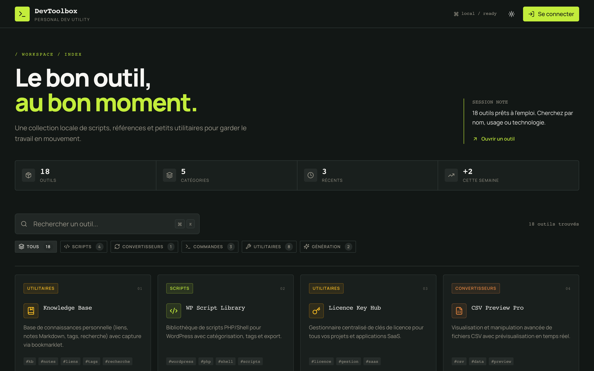
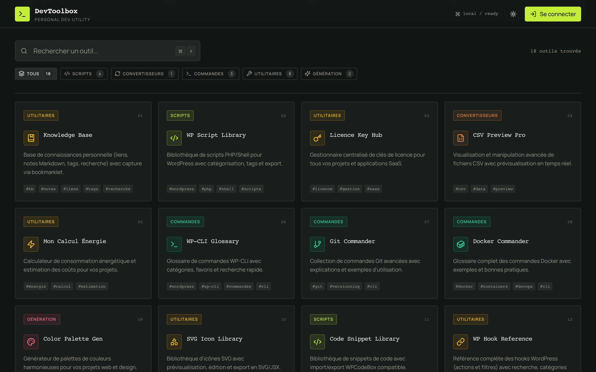
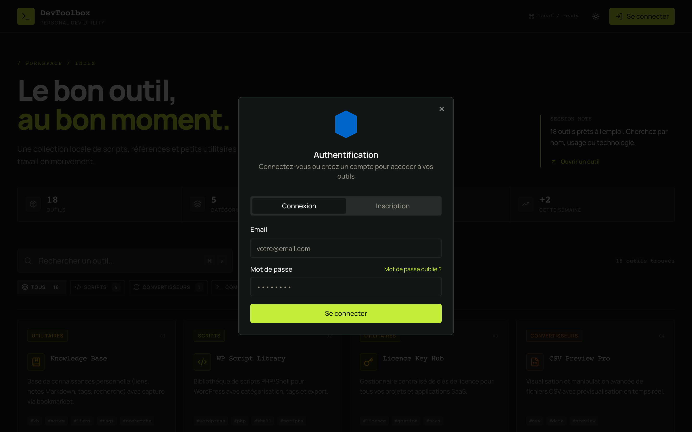

# DevToolbox

Boîte à outils web pour développeurs — Git, Docker, WordPress, snippets, licences, tâches et plus — avec API, auth JWT et déploiement Docker.


## Aperçu

**Accueil** — workspace, stats et recherche d’outils :



**Catalogue d’outils** — 17 outils filtrables par catégorie :



**Authentification** — connexion / inscription (données fictives) :



## Fonctionnalités

- **17 outils** : commandes Git/Docker, snippets, palettes, SVG, WP-CLI / hooks / queries / scripts, Image Resizer, CSV, Markdown, licences, tâches, Knowledge Base, générateurs wp-config / plugin header
- **Auth JWT** multi-comptes, reset mot de passe, Personal Access Tokens (`dt_…`) pour intégrations (Raycast, Hermes, API)
- **Backend** Express + SQLite, notifications (email, Ntfy, Telegram)
- **Docker Compose** prêt pour self-host (images GHCR)
- **Extension [Raycast](raycast/README.md)** : licences, tâches, Knowledge Base
- **Intégration [Hermes Agent](hermes/README.md)** : Task Reminder via API (prod)

## Démarrage rapide (Docker)

**Prérequis** : Docker et Docker Compose

```sh
git clone https://github.com/Crollin/DevToolbox
cd DevToolbox
cp .env.example .env
# Éditer .env : JWT_SECRET obligatoire (openssl rand -base64 32)
docker compose up -d
```

- **Frontend** : http://localhost:14001  
- **API** : http://localhost:1400 (ou via le proxy `/api` du frontend)

Images pré-construites : `ghcr.io/crollin/devtoolbox-frontend` et `ghcr.io/crollin/devtoolbox-backend` — détails dans [DOCKER.md](DOCKER.md).

## Développement local

**Prérequis** : Node.js 20+

```sh
git clone https://github.com/Crollin/DevToolbox
cd DevToolbox

# Backend
cd backend && cp ../.env.example .env && npm install && npm run dev
# → http://localhost:1400

# Frontend (autre terminal)
cd .. && npm install && npm run dev
# → http://localhost:8080
```

Configurez `VITE_API_URL` si besoin (voir `.env.example`).

## Architecture

| Couche | Stack |
|--------|--------|
| Frontend | React, Vite, TypeScript, Tailwind |
| Backend | Node.js, Express, SQLite |
| Auth | JWT + PAT pour intégrations |
| Déploiement | Docker Compose / GHCR |

## Documentation

- [Guide Docker](DOCKER.md)
- [API backend](backend/README.md)
- [Personal Access Tokens (Accès API)](docs/integrations/personal-access-tokens.md)
- [Extension Raycast](raycast/README.md)
- [Agent Hermes](hermes/README.md)
- [CHANGELOG](CHANGELOG.md)
- [CONTRIBUTING](CONTRIBUTING.md) · [SECURITY](SECURITY.md)

## Licence

GPL-3.0 — [LICENSE](LICENSE) · [Creactive Web](https://github.com/Crollin)

Copyright (C) 2024–2026 Creactiveweb
